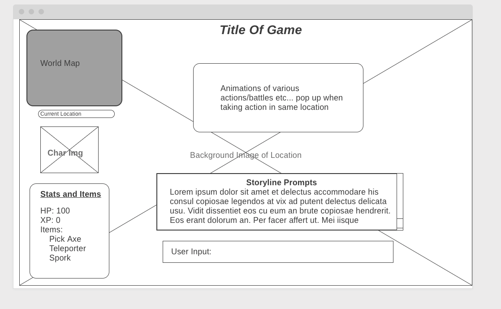

# ReactRPG
A simple text based Interactive Fiction/RPG created by the 2019 Spring Part-time Montana Code School Cohort. Inspired by our love of OG games such as Kings Quest IV, we wanted to create something that also tied in a Role Playing aspect such that the player has a choice of character classes each with their own stats, the ability to name their character, collect items/gold and gain experience points. 

## Components 

### Scene

The Scene component will represent the user in the current *location* and each scene has *prompts* and *actions*.

### Prompt

Text displayed to the user that describes the current scenario, whereever they are at in the story line. Each prompt is a passage of the story and has associated actions the player can choose between to traverse to one of several next passages.

### Action

Buttons representing the available actions are displayed to the user, and the user can select them.

### Battle

Battle passages force the player to either defeat their enemy or attempt to flee back to the previous location. There are enemies chosen at random for some battle scences. Each battle will be unique as the `battleLogic` uses random chance to determine whether the player attacks first or the enemy and each attack will be a random percentage of their total attack power. 


## Database

We are managing our data with MongoDB hosted at MongoDB Atlas, we are an Express.js server within our API as well as the mongoose package to simplify our code. Many of our documents within the database have references to other documents to make  the data more granular and reuseable. 

The main progression through the game is based on a decision tree that gets created when the game loads a `Passage`, each passage contains an array `NextPassages` which refrences the `Passage`s it is possible to traverse to based on the `Action` that the player chooses. The recommended mongoose-autopopulate package being used to create the tree when the game loads or when the player gets close to a leaf node. Limiting the depth of the tree makes in-game reloading quick and straight forward.    

### Models

```
const PlayerCharacterSchema = new mongoose.Schema({
    name: String,
    type: String,
    AP: Number,
    HP: Number,
    XP: Number,
    items: [{
        type: mongoose.Schema.Types.ObjectId,
        ref: 'Item',
        autopopulate: true
    }],
    gold: Number
});
```
```
const PassageSchema = new mongoose.Schema({
    text: String,
    actions: [{
        type: mongoose.Schema.Types.ObjectId,
        ref: 'Action',
        autopopulate: true
    }],
    availableItems: [{
        type: mongoose.SchemaTypes.ObjectId,
        ref : 'Item',
        autopopulate: true
    }],
    nextPassages: [NextPassageSchema],
    location: String,
    nonPlayerCharacters:[{
        type: mongoose.Schema.Types.ObjectId,
        ref: 'NonPlayerCharacter',
        autopopulate: true
    }]
```
```
const LocationSchema = new mongoose.Schema({
    name: {
        type: String,
        required: [true, 'Where exactly? What is the name?']
    },
    environment: {
       type: String,
       required: [true, 'What sort of setting is this?']
    },
   backgroundImageUrl: String,
   nonPlayerCharacters: [{
        type: mongoose.SchemaTypes.ObjectId,
        ref: 'NonPlayerCharacter',
        autopopulate: true,
    }]
});
```
```
const ItemSchema = new mongoose.Schema({
    name:{
        type: String,
        required: [true, 'Please check submission, Item name is required' ]
    },
    value: Number,
    modifier: Number,
    stat: String   
});
```

## Wireframe of GUI

